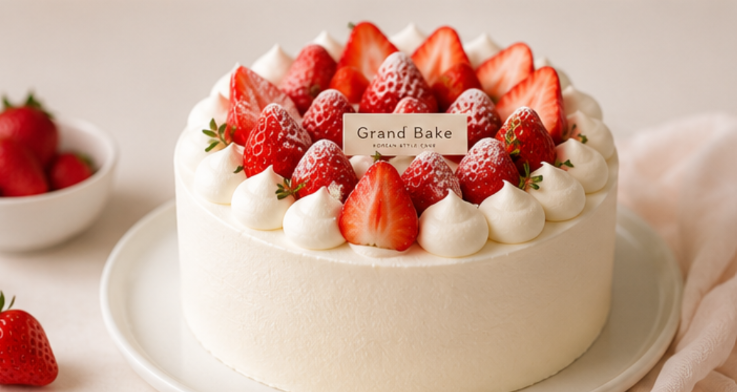
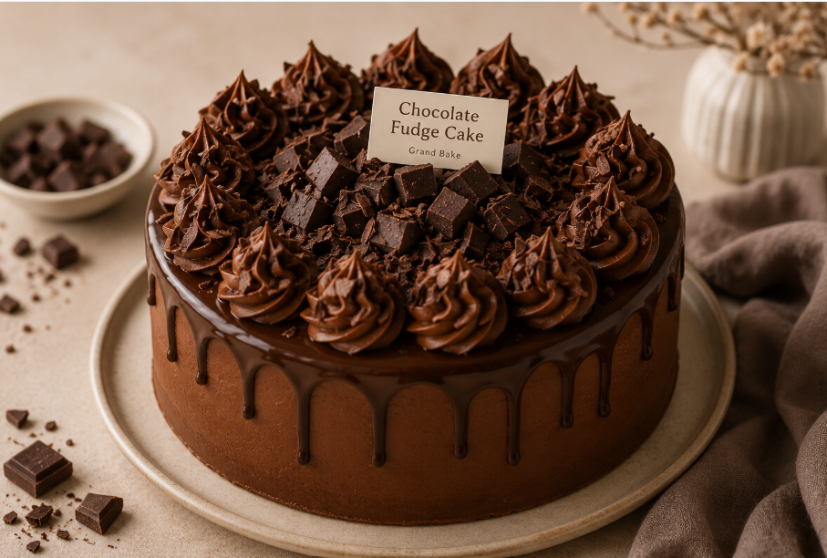
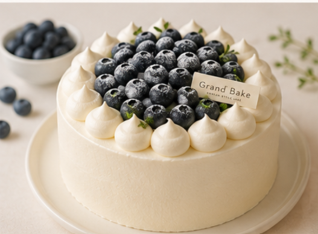

<div align="center">

  

  # 🍰 Grand Bake | Korean Style Cake
  
  **ร้านเค้กสไตล์เกาหลีระดับพรีเมียม สัมผัสความอร่อยในทุกปอนด์ที่คุณเลือก**
  
  <p align="center">
    
    
    
    
    
  </p>

  <p align="center">
    เว็บแอปพลิเคชันระบบสั่งซื้อเค้กออนไลน์ ครบวงจรตั้งแต่หน้าร้าน การสั่งซื้อ ชำระเงิน แนบสลิป ตลอดจนระบบจัดการหลังบ้านสำหรับแอดมิน
  </p>

</div>

---

## ✨ ไฮไลท์ฟีเจอร์เด่น (Key Features)

### 🛒 สำหรับลูกค้า (Customer Features)
- **🎨 หน้าแรก & สไลเดอร์แนะนำเค้ก:** Hero Section พร้อม Slider เค้กขายดี และการ์ดแนะนำสินค้าแบบ Responsive สไตล์มินิมอลเกาหลี
- **🔍 ระบบค้นหา & คัดกรองเค้กทันใจ (Live Search & Filter):** ค้นหาชื่อเค้กและรสชาติได้แบบ Real-time พร้อมตัวกรองตามหมวดหมู่ (ผลไม้สด, ช็อกโกแลต, ชา & มัทฉะ, ชีส & คาราเมล) และจัดเรียงตามราคา
- **🛍️ ระบบตะกร้าสินค้า (Shopping Cart):** เพิ่ม-ลดจำนวน คำนวณราคาสุทธิอัตโนมัติผ่าน LocalStorage
- **📅 กำหนดวัน & เวลารับเค้ก (Delivery Scheduling):** เลือกระบุวันที่และรอบเวลาจัดส่งที่สะดวกรับเค้ก (รอบเช้า, บ่าย, เย็น, ค่ำ)
- **✍️ บริการเขียนข้อความบนหน้าเค้ก / การ์ดอวยพร:** ใส่ข้อความพิเศษส่งตรงถึงคนที่คุณรัก
- **🎟️ ระบบโค้ดส่วนลดโปรโมชั่น (Promo Code):** กรอกโค้ดส่วนลดและคำนวณหักลดราคาสดๆ เช่น `GBNEW10` (ลด 10%), `CAKE50` (ลด 50฿)
- **📱 ชำระเงินด้วย QR พร้อมเพย์ & แนบสลิปโอนเงิน:** สร้าง QR Code ตามยอดสุทธิอัตโนมัติ พร้อมฟอร์มอัปโหลดรูปภาพสลิปโอนเงิน
- **👤 ระบบสมาชิก & ประวัติการสั่งซื้อ (Order History):** ตรวจสอบสถานะคำสั่งซื้อย้อนหลัง ดูใบเสร็จ และจัดการที่อยู่จัดส่งได้ในหน้าโปรไฟล์
- **✉️ ระบบแจ้งเตือนทางอีเมล (Email Confirmation):** ส่งใบเสร็จยืนยันรายการเค้กและรายละเอียดคำสั่งซื้อผ่าน PHPMailer (SMTP)

---

### 🔐 ระบบจัดการหลังบ้านสำหรับแอดมิน (Admin Dashboard)
- **📊 สรุปภาพรวมร้านค้า (Overview Metrics):** รายงานยอดขายรวมสุทธิ, จำนวนคำสั่งซื้อทั้งหมด, ออเดอร์ที่กำลังจัดเตรียม/อบเค้ก, และออเดอร์ที่จัดส่งสำเร็จ
- **🔄 ปรับเปลี่ยนสถานะคำสั่งซื้อแบบ Real-time (AJAX):** เปลี่ยนสถานะ เช่น *ยืนยันแล้ว ➔ กำลังจัดเตรียม ➔ กำลังจัดส่ง ➔ จัดส่งสำเร็จ* บันทึกลงฐานข้อมูลทันทีโดยไม่ต้องรีเฟรชหน้า
- **📎 ตรวจสอบสลิปโอนเงิน:** มีปุ่มกดดูรูปภาพสลิปโอนเงินขนาดเต็มของลูกค้าได้ทันที
- **🏷️ พิมพ์ใบปะหน้าเค้ก (Order Slips):** ปุ่มพิมพ์ใบสั่งซื้อสำหรับติดหน้ากล่องเค้กส่งให้ไรเดอร์
- **🔍 ค้นหาและกรองคำสั่งซื้อ:** ค้นหาตามชื่อลูกค้า, เบอร์โทรศัพท์, หรือเลขที่คำสั่งซื้อ

---

## 📸 ภาพตัวอย่างหน้าจอ (Screenshots)

<div align="center">

| หน้าแรก (Landing Page) | แคตตาล็อกเค้ก & ตัวกรอง (Catalog) |
|:---:|:---:|
|  |  |

| ระบบชำระเงิน & แนบสลิป | ประวัติการสั่งซื้อ & โปรไฟล์ |
|:---:|:---:|
|  |  |

</div>

---

## 🛠️ เทคโนโลยีที่ใช้ (Tech Stack)

- **Frontend:** HTML5, CSS3 (Modern Flexbox & CSS Grid), Vanilla JavaScript (ES6+), Google Fonts (*Noto Serif Thai*, *Prompt*)
- **Backend:** PHP 8.0+
- **Database:** MySQL / MariaDB (InnoDB, UTF-8mb4)
- **Email Service:** PHPMailer ผ่าน Gmail SMTP
- **Local Environment:** XAMPP (Apache, MySQL, PHP)

---

## 🚀 วิธีการติดตั้งและรันโปรเจกต์ (Installation Guide)

### 1. ติดตั้งเครื่องมือที่จำเป็น
- ดาวน์โหลดและติดตั้ง [XAMPP](https://www.apachefriends.org/)

### 2. นำไฟล์โปรเจกต์ไปไว้ที่ htdocs
Clone หรือคัดลอกโฟลเดอร์โปรเจกต์นี้ไปไว้ที่โฟลเดอร์ `htdocs` ของ XAMPP:
```bash
cd C:\xampp\htdocs
git clone https://github.com/your-username/grandbake.git
```

### 3. เริ่มต้นการทำงานของเซิร์ฟเวอร์
1. เปิดโปรแกรม **XAMPP Control Panel**
2. กดปุ่ม **Start** ที่โมดูล **Apache** และ **MySQL**

### 4. สร้างฐานข้อมูล (Database Setup)
1. เปิดเบราว์เซอร์ไปที่ `http://localhost/phpmyadmin`
2. สร้างฐานข้อมูลใหม่ชื่อ: **`grand_bake`**
3. ระบบของ Grand Bake มีกลไก **Auto Create Tables** จะทำการสร้างตาราง `users`, `orders`, และ `order_items` ให้โดยอัตโนมัติเมื่อมีการเปิดใช้งานเว็บครั้งแรก

### 5. เปิดใช้งานเว็บไซต์
- **หน้าร้านค้า:** [http://localhost/grandbake/](http://localhost/grandbake/)
- **ระบบหลังบ้านแอดมิน:** [http://localhost/grandbake/admin_orders.php](http://localhost/grandbake/admin_orders.php)
  - 🔑 **รหัสผ่านเข้าหลังบ้านเริ่มต้น:** `admin1234`

---

## 📁 โครงสร้างโปรเจกต์ (Directory Structure)

```text
grandbake/
├── admin_orders.php      # ระบบจัดการหลังบ้านแอดมิน (Dashboard & Order Status)
├── cart.html             # หน้าตะกร้าสินค้า (Shopping Cart)
├── checkout.php          # หน้ากรอกข้อมูลจัดส่ง, นัดวันเวลา, โค้ดส่วนลด
├── db.php                # การเชื่อมต่อฐานข้อมูล MySQL
├── detail.html           # หน้ารายละเอียดเค้กแต่ละเมนู
├── index.php             # หน้าแรกของร้าน (Landing Page & Hero Slider)
├── login.php             # หน้าเข้าสู่ระบบสมาชิก
├── logout.php            # ออกจากระบบ
├── order_success.php     # หน้ายืนยันคำสั่งซื้อ, QR พร้อมเพย์, อัปโหลดสลิป
├── process_order.php     # API ประมวลผลคำสั่งซื้อและบันทึกลง Database
├── products.php          # หน้าสินค้าทั้งหมด พร้อมระบบ Live Search & Filters
├── profile.php           # หน้าบัญชีผู้ใช้ & ประวัติการสั่งซื้อ (Order History)
├── register.php          # หน้าสมัครสมาชิกใหม่
├── send_order_email.php  # ฟังก์ชันส่งอีเมลยืนยันคำสั่งซื้อด้วย PHPMailer
├── style.css             # สไตล์หลักของเว็บไซต์ (Korean Bakery Theme)
├── uploads/              # โฟลเดอร์เก็บรูปภาพสลิปการโอนเงิน
│   └── slips/
└── vendor/               # ไลบรารีภายนอก (PHPMailer)
```

---

## 💡 โค้ดส่วนลดสำหรับทดสอบ (Demo Promo Codes)
- **`GBNEW10`** : รับส่วนลดทันที 10%
- **`CAKE50`** : รับส่วนลดทันที 50 บาท
- **`GRAND20`** : รับส่วนลดทันที 20%

---

## 📄 License
This project is open-source and available under the [MIT License](LICENSE).

<div align="center">
  <sub>Made with 🤎 for Grand Bake | Sweet Moments, Always</sub>
</div>
